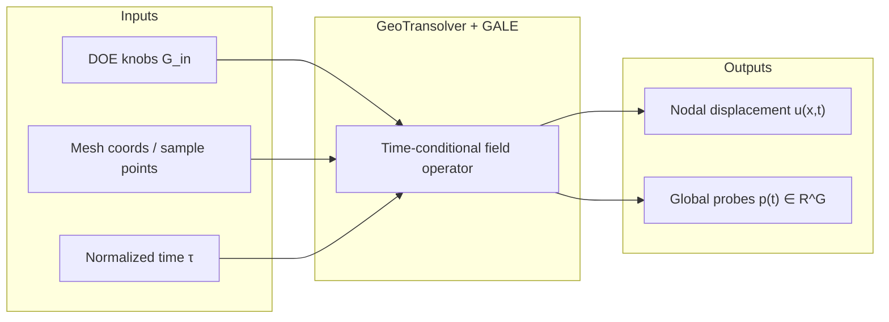
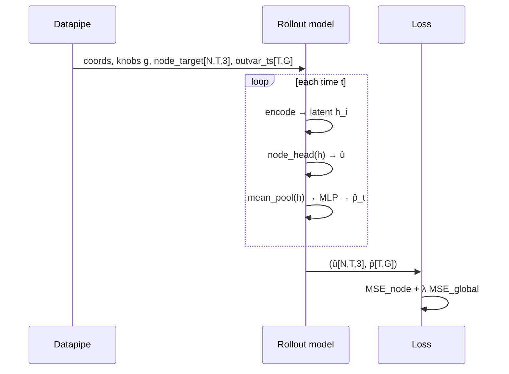
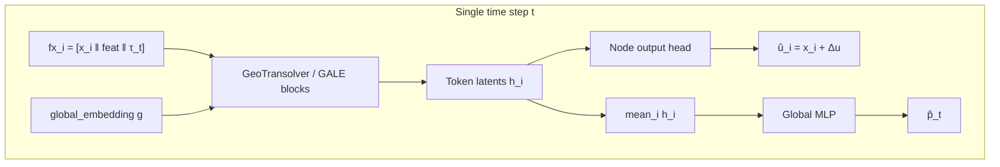
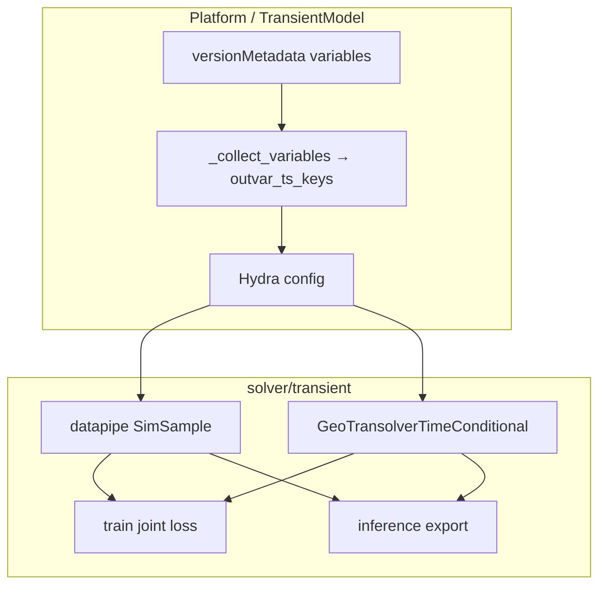

# Implementation plan — Transient GeoTransolver joint nodal + global time-series outputs

**Status:** Design for review (no code yet)  
**Date:** 2026-08-13  
**Branch:** `rescale-ai` → `feat/transient-global-ts-outputs`  
**Audience:** Andre (+ Guangchen) — review before Phase 2 implement  
**Phase 1 data:** Done on HPS (`mclaren-p35-side-pole-19`: knobs in, `displacement_t*` nodal out, 39 probe channels × 41 frames as global TS out). Coding uses **synthetic mini fixtures** that match that schema.

Related docs:

- Checklist / phases: [`geotransolver-global-ts-plan.md`](./geotransolver-global-ts-plan.md)
- Probe channel freeze: [`probe-global-schema.md`](./probe-global-schema.md)
- Branch design stub: `rescale-ai/rescale_ai/solver/transient/GLOBAL_TS_OUTPUTS.md`

---

## 1. Why we are doing this

McLaren scorecards need **probe histories** (head/T1/T12/pelvis acc, rib deflections, load-cell forces/moments) **and** the **full-field displacement** trajectory.

Putting probes on the VTP as sparse nodal fields fails: almost all nodes are zero → mean-over-$N$ loss learns “predict zero.” Phase 1 moved probes into `case_data.yml` → `timeseries:` as **global** channels of length $T$.

Stock **Transient** today:

- Accepts scalar global **inputs** (DOE knobs).
- Predicts nodal **outputs** only (`displacement_t*`).
- **Rejects / ignores** global time-series **outputs**.

Stock **FEA MeshGraphNet** (Guangchen) already has the missing piece: `outvar_ts` + mean-pool global decoder. We **port that contract into Transient GeoTransolver**, not run MGN on ~1.28M-node meshes.



---

## 2. What GeoTransolver is (NVIDIA / PhysicsNeMo)

Primary sources:

- Paper: [GeoTransolver (arXiv:2512.20399)](https://arxiv.org/abs/2512.20399) — *Learning Physics on Irregular Domains Using Multi-scale Geometry Aware Physics Attention Transformer*
- PhysicsNeMo docs: [Transformer models for irregular meshes](https://docs.nvidia.com/physicsnemo/latest/physicsnemo/examples/cfd/external_aerodynamics/transformer_models/README.html)
- Backbone lineage: **Transolver** (Wu et al., 2024) + **DoMINO**-style multi-scale ball queries

### 2.1 Core idea

GeoTransolver is a **neural operator** on unstructured points. It does **not** build a mesh graph (unlike MGN). It:

1. Samples / embeds local point features into **physics-aware latent slices**.
2. Builds a **shared geometry + global + BC context** once via multi-scale ball queries.
3. In every block, runs **GALE** (Geometry-Aware Latent Embeddings):
   - self-attention within slices (physics couplings),
   - **cross-attention** to the shared context (geometry / globals persistently recalled).

Schematically (paper §3; notation compressed):

$$
\begin{aligned}
C &= \mathrm{ContextProjector}\big(\mathrm{BallQuery}_{\text{multi-scale}}(\text{geometry}),\, g\big), \\
H^{(\ell+1)} &= \mathrm{GALE}\big(H^{(\ell)},\, C\big)
  = \mathrm{Mix}\Big(
      \mathrm{SelfAttn}_{\text{slice}}(H^{(\ell)}),\;
      \mathrm{CrossAttn}(H^{(\ell)},\, C)
    \Big),
\end{aligned}
$$

where $g$ are **global operating parameters** (in CFD: AoA, Mach; for us: DOE knobs). Context $C$ is **reused at every depth** so latents stay anchored to domain + regime.

Outputs are typically **per-point fields**. Industrial scalar QoIs (drag/lift) in NVIDIA recipes are often:

- **derived** by integrating predicted surface fields, and/or
- predicted by a **separate head** on pooled geometry embeddings (e.g. variational GP head on `embedding_states` after attention pooling).

That second pattern is the closest NVIDIA analogue to “predict globals from the backbone,” but their QoIs are **steady scalars**. Ours are **time series of crash responses** — closer to Guangchen’s FEA `outvar_ts` head than to Cd integration.

### 2.2 How Rescale Transient uses it today

Enabled scheme: `geotransolver_time_conditional` (`GeoTransolverTimeConditional` in `solver/transient/rollout.py`).

**Training (one random / scheduled time index):**

$$
\begin{aligned}
\tau_t &= t / (T-1), \\
f_i &= \big[\, x_i \;\Vert\; \text{features}_i \;\Vert\; \tau_t \,\big], \\
\Delta\hat{u}_i &= \mathrm{GeoT}\big(f,\, x,\, g\big)_i, \\
\hat{u}_i(t) &= x_i + \Delta\hat{u}_i[:3].
\end{aligned}
$$

**Eval rollout:** loop $t = 0..T-2$, stack → $\hat{u} \in \mathbb{R}^{N \times T \times 3}$.

Knobs $g$ already enter as `global_embedding` (same role as CFD globals). **There is no global output head.**

Internal note (Guangchen / DST): GeoTransolver is proven for **time-series field** outputs; **response curves** (force/acc) are less exercised there but “technically feasible” — this plan is that extension.

---

## 3. What Guangchen’s FEA MGN already does (steal the contract)

Reference: `rescale_ai/solver/fea/rollout.py` → `MeshGraphNetTimeConditionalRollout` when `global_output_dim > 0`.

Per timestep $t$:

1. GNN processor produces node latents $h_i^{(t)} \in \mathbb{R}^{H}$.
2. Node head → displacement residual.
3. **Global decoder:**

$$
\bar{h}^{(t)} = \frac{1}{N}\sum_{i=1}^{N} h_i^{(t)},
\qquad
\hat{p}^{(t)} = \mathrm{MLP}\big(\bar{h}^{(t)}\big) \in \mathbb{R}^{G}.
$$

Stack $\hat{p}^{(t)}$ → $\hat{P} \in \mathbb{R}^{T \times G}$.  
Datapipe loads GT as `outvar_ts` with the same shape.  
Train with joint MSE (node + $\lambda$ · global); **loss balance mattered on GMI**.



**We copy:** schema (`outvar_ts_keys`, `[T,G]`), stats, joint loss, export shape.  
**We do not copy:** graph edges / MGN processor (impractical at McLaren scale).

---

## 4. Target mathematical problem (McLaren)

Let:

| Symbol | Meaning | McLaren scale |
|--------|---------|----------------|
| $x_i$ | node / sample coordinates | $N \sim 10^6$ (sampled subset in GeoT) |
| $g \in \mathbb{R}^{G_{\mathrm{in}}}$ | DOE knobs | $G_{\mathrm{in}} = 11$ |
| $u(x,t) \in \mathbb{R}^{3}$ | displacement field | $T = 41$ frames |
| $p(t) \in \mathbb{R}^{G_{\mathrm{out}}}$ | probe vector | $G_{\mathrm{out}} \approx 39$ |

Learn operator

$$
\mathcal{F}_\theta : (x,\, g,\, t) \mapsto \big(\hat{u}(x,t),\, \hat{p}(t)\big)
$$

with supervised targets from LS-DYNA extracts (field on VTP; probes from PSA / converter → YAML).

**Synthetic mini fixtures** for unit tests shrink to e.g. $N=64$, $T=4$, $G_{\mathrm{in}}=3$, $G_{\mathrm{out}}=5$, same tensor contracts.

---

## 5. Proposed v1 architecture (GeoTransolver + global decoder)

### 5.1 Design choice (recommended)

**v1 = FEA-parity mean-pool decoder on GeoT token latents**, attached to `GeoTransolverTimeConditional` only (the enabled McLaren scheme).

Rationale:

| Option | Idea | Pros | Cons |
|--------|------|------|------|
| **A — Mean-pool + MLP on point latents (v1)** | Mirror FEA MGN | Small diff; reviewable; known loss recipe | Pool may blur contact-local probes |
| **B — Attention-pool on geometry/`embedding_states`** | NVIDIA GP-head style | More “GeoT native”; learnable focus | Needs intermediate hooks; more code |
| **C — Globals from $g,\tau$ only** | Tiny MLP | Cheap | Ignores deformation → wrong for crash probes |
| **D — Integrate field → probes** | Physics postprocess | Interpretable | Acc/force probes ≠ surface integrals of displacement |

**Decision for implement:** ship **A**. Keep **B** as Phase 2.5 if probe metrics stall. Never **C** as primary.

### 5.2 Where to read latents

GeoT’s public `forward` returns **node predictions**, not processor states. Two implementation paths:

1. **Preferred for v1:** wrap / subclass so one forward returns `(node_pred, token_latent)` analogous to FEA `_forward_gnn` → `(node_out, latent)`. Token latent = last hidden features **before** the output head, shape `[N, H]` (or batched `[1,N,H]`).
2. **Fallback:** run a light second MLP on **concat** $[\,\hat{u}_i,\, f_i\,]$ then mean-pool — worse (uses outputs not latents) — only if hooks are painful.

Mean-pool must be **over the points GeoT actually saw** (full mesh or sampled subset — match training datapipe).

### 5.3 Time-conditional global head

Training currently predicts **one** time per forward. Align globals the same way:

$$
\hat{p}_t = \mathrm{MLP}_\phi\Big(\mathrm{mean}_i\, h_i(t;\, g)\Big) \in \mathbb{R}^{G}.
$$

Eval `_rollout`: for each $t$, append $\hat{p}_t$, stack → $\hat{P} \in \mathbb{R}^{T \times G}$.



When `global_output_dim == 0`, behavior stays bitwise as today (nodal-only tensor return) for regression safety.

### 5.4 Why this should work (mechanism)

1. **Same conditioning as the field.** Knobs $g$ already cross-attend via GALE; probe responses in crash are strong functions of those knobs (TTF, foam, door gauge, …) **and** of the evolving deformation. Reading latents that already mix geometry + $g$ + $\tau$ is the right information bottleneck.
2. **Probes are (approximate) functionals of the state.** Occupant / structure instrumentation is determined by the contact/deformation history. A decoder on pooled field latents is the standard multi-task pattern (MGN+, DoMINO global heads, NVIDIA pooled embeddings → Cd).
3. **Time alignment is explicit.** $\tau_t$ in the nodal path forces $\hat{p}_t$ to the same clock as $\hat{u}(\cdot,t)$ and GT `outvar_ts[t]`.
4. **Permutation / sampling robustness.** Mean-pool is invariant to point order; GeoT already trains on irregular samples — globals should not require fixed node IDs (unlike sparse VTP overlays).
5. **Avoids the sparse-label pathology.** GT is dense in time for each of $G$ channels, not $N$ almost-zero nodal masks.

---

## 6. Loss, normalization, and balancing

### 6.1 Joint loss

$$
\mathcal{L}
  = \underbrace{\big\| \hat{u} - u \big\|_2^{2}}_{\mathcal{L}_{\mathrm{disp}}}
  + \lambda\,
    \underbrace{\big\| \hat{p} - p \big\|_2^{2}}_{\mathcal{L}_{\mathrm{probe}}}
$$

(with optional per-channel weights $w_c$ on probes).

Log **separately**: `loss/disp`, `loss/probe`, and optionally top-$k$ worst channels.

### 6.2 Normalization (required)

Probe channels span wildly different scales (accelerations vs forces vs moments vs rib defl). Datapipe must compute:

$$
\tilde{p}_c = \frac{p_c - \mu_c}{\sigma_c + \varepsilon},
\qquad
\mu_c, \sigma_c \text{ over cases × time}.
$$

Same for nodal displacement (already present). Decode for export with inverse transform.

### 6.3 Choosing $\lambda$

GMI lesson: **joint multi-output training is sensitive to loss balance.** Displacement MSE averages over $N \times 3$; probe MSE over $G$ — without care, one term dominates.

Practical schedule for smoke → real train:

1. Start $\lambda = 1$ on **normalized** spaces (often OK).
2. If TB shows $\mathcal{L}_{\mathrm{probe}} \ll \mathcal{L}_{\mathrm{disp}}$ early → raise $\lambda$ (e.g. 10–100).
3. If displacement collapses → lower $\lambda$.
4. Optional: uncertainty weighting or per-group $\lambda$ (acc / force / moment / rib).

### 6.4 GMI “don’t predict everything” caveat

Internal accuracy notes warn against stuffing **qualitatively unrelated** outputs into one head. We still want one model for scorecard convenience, but:

- v1 trains **all 39** channels (matches frozen schema).
- If learning is poor, **Phase 2.5** can split groups (e.g. accelerations vs load cells) or down-weight near-zero channels (`t12_loadcell_*` often ≈ 0 on starter set).

Starter **18 OFAT** cases: Phase 3 is a **plumbing smoke**, not an accuracy claim.

---

## 7. Platform / data wiring (concrete touch points)

No HPS required to implement; synthetic fixtures only.

| Layer | File(s) | Change |
|-------|---------|--------|
| Variable collection | `models/transient_model.py` | Allow `globalVariables` **output** matching `_t*`; dedupe → `outvar_ts_keys` / `global_output_dim`. Keep rejecting **input** TS globals. |
| Hydra / config | transient solver YAMLs | `datapipe.outvar_ts_keys`, `model.global_output_dim`, `training.global_loss_weight` ($\lambda$) |
| Datapipe | `solver/transient/datapipe.py` (+ FEA helper reuse) | Load YAML `timeseries` → `SimSample.outvar_ts [T,G]`; stats `outvar_ts_{mean,std}`; assert `T` matches nodal |
| Rollout | `solver/transient/rollout.py` | `GeoTransolverTimeConditional`: optional global decoder; return tuple when $G>0$ |
| Train / val | `solver/transient/train.py` | Unpack tuple; joint loss; TB scalars; val MSE_probe |
| Inference | `solver/transient/inference.py` | Write probe JSON/YAML next to predicted VTP; inverse-norm |
| Tests | `tests/` | Synthetic mini mesh + YAML; 1–2 train steps; variable collection unit tests |



**UI note:** Do **not** rely on “Train from dataset” on the tiny workstation for this work. Use editable install + CLI/training entry on Grossular when ready. The create-model wizard + huge variable lists has already wedged CPU boxes; coding path stays local + GPU job later.

---

## 8. Synthetic mini-fixture contract (for TDD)

Minimal case directory:

```text
synth_case/
  case_data.vtp          # tiny mesh, displacement_t0..t{T-1}
  case_data.yml
```

```yaml
# case_data.yml
knob_a: 1.0
knob_b: 0.5
timeseries:
  timesteps: [0.0, 0.25, 0.5, 0.75]   # doc only; disable in metadata
  probe_fx: [0.0, 0.1, 0.2, 0.15]
  probe_ay: [0.0, -1.0, -2.0, -1.5]
```

Metadata stub: knobs → global input; `probe_*_t*` → global output; `displacement_t*` → node output.

Asserts in tests:

1. `outvar_ts.shape == (T, G)`
2. Forward returns `(node[N,3], global[G])` in train step / `(node[N,T,3], global[T,G])` in rollout
3. `global_output_dim=0` → old nodal-only path
4. Mismatched $T$ → hard error

---

## 9. Implementation sequence (when we get the green light)

Ordered for reviewable diffs:

1. **Tests first** — synthetic fixture + failing tests for collection / datapipe shapes.
2. **`_collect_variables` + config** — unlock global TS outputs; wire dims.
3. **Datapipe + stats** — FEA-compatible loader.
4. **Global decoder on `GeoTransolverTimeConditional`** — latent hook + MLP + rollout stack.
5. **Train/val loss + logging**.
6. **Inference export**.
7. **Update** `GLOBAL_TS_OUTPUTS.md` to “implemented”; short note for Guangchen.
8. **Phase 3** (later) — Grossular smoke on real HPS dataset; plots of 1–2 probe channels GT vs pred + displacement sanity.

Explicitly **out of v1**: attention-pool decoder, one-shot / autoregressive schemes, extractor tile rewrite, AutoML, Train-UI polish.

---

## 10. Risks & later considerations

| Risk | Why it matters | Mitigation |
|------|----------------|------------|
| Latent hook unavailable / shape mismatch | Can’t pool GeoT states | Spike early; fallback documented in §5.2 |
| Mean-pool washes contact | Shoulder/pubic forces local | Attention-pool (option B); or condition decoder on knobs+$\tau$+pooled |
| $\lambda$ / scale imbalance | One loss dominates | Normalize; TB split; tune $\lambda$ |
| 39 heterogeneous channels | Acc vs force vs moment | Per-channel stats; optional group weights |
| Near-constant channels | Zero load cells | Down-weight or disable in metadata |
| Time misalignment | Wrong probe clock | Assert $T$; converter already resamples to disp frames |
| Thin DOE | Overfit / meaningless R² | Call Phase 3 a plumbing test |
| OOM on real mesh | Same as today | `num_workers=1`; existing GeoT sampling; GPU job not Kyanite |
| Platform eval displacement-only | Probes invisible in UI | Local export script; follow-up ticket |
| Train UI wedges WS | Seen repeatedly | Never open train wizard for bring-up; CLI only |
| Multi-task interference (GMI) | Unrelated outputs hurt | Monitor; split heads/groups if needed |

---

## 11. Success criteria (review checklist)

**Ready to implement when we agree:**

- [ ] v1 = mean-pool + MLP on GeoT latents (FEA parity), time-conditional only  
- [ ] Joint normalized MSE with tunable $\lambda$  
- [ ] Synthetic fixtures drive CI (no HPS dependency for coding)  
- [ ] Inference writes probe TS files; VTP displacement unchanged  
- [ ] Phase 3 = smoke on Grossular, not accuracy gate  

**Done (code) when:**

- [ ] Unit tests green on synthetic shapes  
- [ ] `global_output_dim=0` regression path unchanged  
- [ ] Short train step runs on CPU/GPU with both loss terms finite  

**Done (product smoke) when:**

- [ ] Real dataset trains without “TS globals not supported”  
- [ ] At least one probe channel plot looks non-degenerate (not all ~0)  
- [ ] Guangchen OK on decoder placement + loss  

---

## 12. References

**External**

- Ranade et al., *GeoTransolver*, [arXiv:2512.20399](https://arxiv.org/abs/2512.20399)  
- NVIDIA PhysicsNeMo — [Transformer models / GeoTransolver + GALE + GP head](https://docs.nvidia.com/physicsnemo/latest/physicsnemo/examples/cfd/external_aerodynamics/transformer_models/README.html)  
- Transolver (Wu et al., 2024); DoMINO multi-scale ball queries (NVIDIA)

**Internal**

- Guangchen FEA global decoder: `solver/fea/rollout.py` (`global_output_dim`, mean-pool → MLP)  
- Transient nodal path: `solver/transient/rollout.py` (`GeoTransolverTimeConditional`)  
- Slack / DST: GeoTransolver needs extension for force/acc-style globals (McLaren thread)  
- GMI accuracy notes: loss balance; avoid stuffing unrelated outputs into one model  
- Crash FEA tutorial: prefer GeoTransolver over MGN for large deform meshes  

---

## 13. One-paragraph summary for tomorrow

We will extend Transient **GeoTransolver time-conditional** with Guangchen’s FEA **`outvar_ts` contract**: after each timed GeoT forward, **mean-pool token latents → MLP → $\hat{p}_t$**, stack over time, and train $\mathcal{L}_{\mathrm{disp}}+\lambda\mathcal{L}_{\mathrm{probe}}$ on **normalized** targets. That matches how NVIDIA already treats globals as **persistent GALE context** on the input side and how they attach **pooled embedding heads** for scalar QoIs — adapted here to **crash probe time series**. Coding uses synthetic mini fixtures; HPS only for a later Grossular smoke. Main watchouts: latent hook, $\lambda$/channel scaling, mean-pool locality, and not trusting the Train UI on small workstations.
