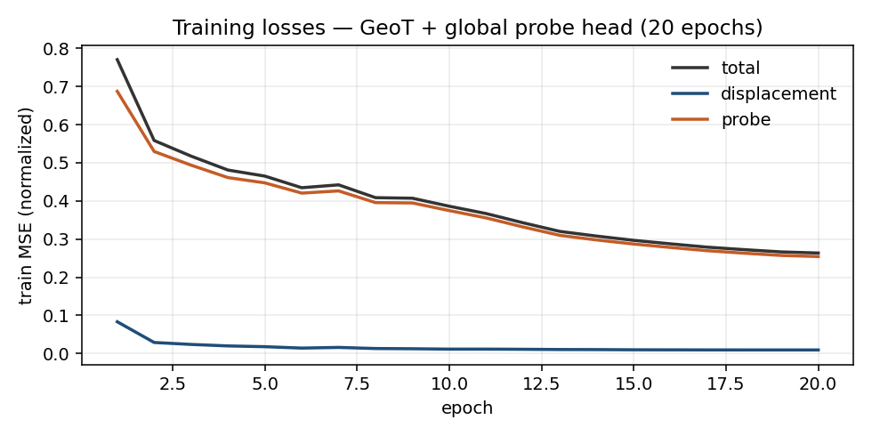
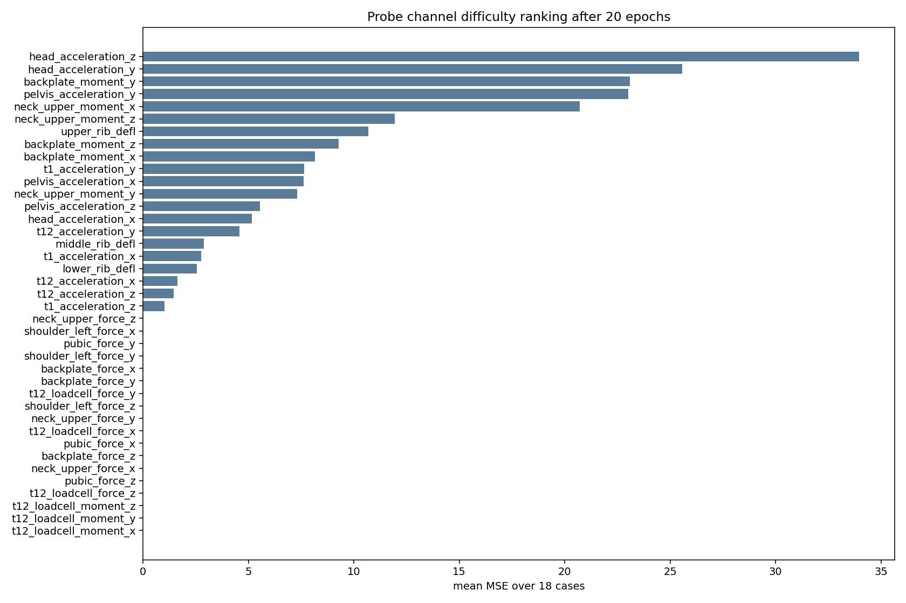
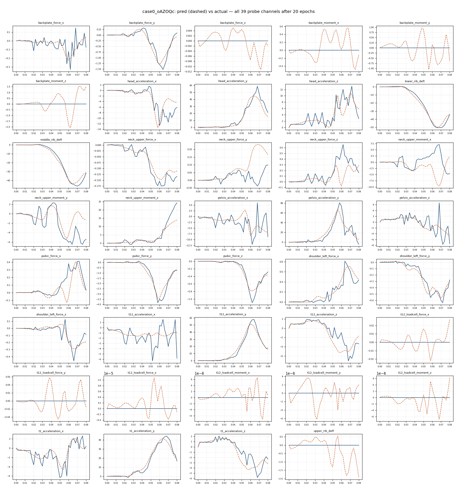

# Handoff — Transient GeoTransolver global time-series outputs (McLaren side-pole)

**Date:** 2026-08-14 Fri evening → **updated 2026-08-20**  
**Audience:** Andy · Guangchen (PR review) · Andre  
**Status (current):** P0 labels **fixed**. Clean 18-case train on `cXBNn` finished at 200 epochs. Plumbing PR: **https://github.com/rescale/rescale-ai/pull/1217**. Guangchen (2026-08-20): PR looks great, results good for 18 cases, “basically in good shape,” review this afternoon then merge + **dev** test. Live notes: [`.claude/handoffs/2026-08-18-transient-global-ts.md`](../.claude/handoffs/2026-08-18-transient-global-ts.md). Sections below this banner are the **Aug 14–15 history** (poisoned 39-channel run on `ApZxU`) — keep for why we re-extracted, not for probe accuracy.

**Artifacts:**
- Clean holdout (28 channels, `crashPostProcOK`): [`docs/geotransolver-holdout-clean-2026-08/`](./geotransolver-holdout-clean-2026-08/)
- Epoch-200 holdout grids (also on the PR): `docs/geotransolver-holdout-clean-2026-08/plots/epoch_200/`
- **Poisoned** 39-channel holdout (ignore probe MSE): [`docs/geotransolver-holdout-2026-08/`](./geotransolver-holdout-2026-08/)
- In-sample 20-ep smoke: [`docs/geotransolver-handoff-2026-08/`](./geotransolver-handoff-2026-08/)

Related plans (already written earlier this week):

- [`geotransolver-global-ts-implementation-plan.md`](./geotransolver-global-ts-implementation-plan.md)
- [`geotransolver-global-ts-plan.md`](./geotransolver-global-ts-plan.md)
- [`probe-global-schema.md`](./probe-global-schema.md)
- Converter: `mclaren-crash-pole/scripts/convert_probes_to_global_ts.py`

---

## 0. Monday P0 — flat-zero probes = bad labels (read this first)

**Flat zero across a crash is not physics.** It is a failed probe read / metadata mapping. Training on those channels is training nonsense.

### What we audited (Sat early AM)

All **18** `case_data.yml` `timeseries:` channels vs full-mesh VTPs under  
`/enc/udeprod.fNLMWb/work/datasets/mclaren-p35-side-pole-19/cases/`.

| Class | Channels | What it means |
|-------|----------|----------------|
| **Always zero on all 18** | `t12_loadcell_force_z`, `t12_loadcell_moment_{x,y,z}` | Never present as nonzero on the sparse VTP cloud — extractor didn’t emit / sim didn’t populate those components in the AI surface |
| **Zero on same 8/18 cases** | `upper_rib_defl`, `backplate_force_z`, `backplate_moment_{x,y,z}`, `t12_loadcell_force_{x,y}` | **VTP often has real signal**; YAML is wrong because conversion grabbed the **wrong sparse node** |

Zero-on-8 cases (identical set):  
`case0_oAZOQc`, `case1_fcWXEc`, `case4_aYQpTc`, `case6_UdFFQc`, `case8_JDrsac`, `case9_bcLVXb`, `case13_PUfJXb`, `case15_raMAac`.

### Root cause (conversion / bookkeeping — not “padding physics”)

1. Platform cases have **no PSA CSVs** and VTPs have **no `NODE_ID` / `PROBE_CODE`**.
2. `convert_probes_to_global_ts.py` falls back to **XYZ nearest** among a **union** of all nonzero `acceleration`/`force`/`moment`/`rib_defl` nodes.
3. `upper_rib`, `shoulder_left`, `backplate`, `t12_loadcell` sit in a **~10 mm X-spaced cluster** (same Y/Z in `docs/probe_point_index.json`). Easy to swap.
4. Smoking gun on **case0**: converter assigned `upper_rib` → a **force** node (rib_defl=0 → YAML flat zero) while the real upper-rib deflection (~35) sat orphaned on another cluster node that then got labeled `t12_loadcell` (force=0). **case3** got lucky and mapped correctly — same DOE family, different mesh → different winner.

LS-DYNA source runs almost certainly still have real probes (Andy to confirm case-by-case Monday). The **AI-extract sparse nodal cloud + our nodal→global converter** is what poisoned YAML.

### Converter behavior that makes it worse

```text
# convert_probes_to_global_ts.py — force_moment path
# Always emit xyz once the probe point is identified so G is stable (zeros allowed).
```

Missing / wrong nodes become **explicit zero series**, then we train on them.

### Monday fix order (Andy)

1. **Stop** treating holdout/probe MSE as scorecard until labels are clean.
2. Dig original LS-DYNA / PSA (or re-extract) — confirm which cases truly lack channels vs extract gaps.
3. **Extractor fix (in progress on branches `feat/probe-global-timeseries`):**
   - **AI** (`automation-ai-extractor`): PSA → `case_data.yml` `timeseries:` directly; sparse nodal overlays optional via `probe_map.json` → `extract.probe_nodal` (bundled McLaren map defaults **globals on / nodal off**).
   - **Metadata** (`automation-metadata-extractor`): DOE `extract.timeseries: ["*"]`; preserves AI-written timeseries when rewriting knobs.
4. Re-extract McLaren cases (or re-run tiles on Utilities clones) → verify no flat-zero labels where PSA has signal.
5. Drop always-missing channels from train `outvar_ts_keys` until PSA has them.
6. Retrain holdout only **after** labels are clean (old ckpts poisoned).
7. Keep `scripts/verify_probe_globals.py` as a gate (fail if YAML flat-zero while PSA CSV is nonzero).

Until then: displacement plumbing + “alive” probe channels (head/pelvis Y-acc, middle/lower ribs, etc.) are still useful for architecture review; **flat plots are data bugs**.

---

## 1. One-paragraph verdict

We taught Transient **GeoTransolver time-conditional** to predict **occupant probe time series as global outputs** alongside **nodal displacement**, by porting Guangchen’s FEA MGN `outvar_ts` contract (mean-pool GALE token latents → MLP → joint MSE with λ). Plumbing works on Grossular (`ApZxU`). We also ran a **fair holdout** retrain (16 train / 2 holdout → 200 epochs). **However:** Saturday audit showed several global GT channels are flat zero or mis-mapped from the sparse nodal extract — so probe accuracy numbers (smoke + holdout) are **contaminated** and must not be sold as physics until Monday’s probe/metadata fix. Displacement trends and “obviously alive” probe curves are still informative for the architecture review.

---

## 2. What we actually coded (for Guangchen / Monday-you)

### Branch

Repo: `rescale-ai`  
Branch: **`feat/transient-global-ts-outputs`**  
**PR:** https://github.com/rescale/rescale-ai/pull/1217 (review requested from `guangchen-rescale`).

That PR has the `file_utils` clock-key skip and the **epoch-200** holdout 28-channel grids. Workstation Hydra yamls stay out of `rescale-ai`; experiment copies live in `scripts/ws_p35_probes/` here.

### Architecture (v1)

```text
knobs g  +  mesh coords x  +  τ=t/(T-1)
                │
                ▼
     GeoTransolverTimeConditional (one timed forward)
                │
                ├─► nodal Δû → û = x + Δû[:3]          (displacement)
                └─► GALE token latents H (before ln_mlp_out)
                          │
                          ▼
                 mean-pool over N → MLP → p̂_t ∈ R^G
```

Training sample type: **`one_time_step`** (random/scheduled frame).  
Eval / export: full rollout → nodal `[N, T−1, 3]` + global `[T−1, G]`, then pad t0 for export so JSON/VTP have **T=41**.

Loss:

```text
L = MSE(disp_pred, disp_target) + λ · MSE(probe_pred, outvar_ts)
λ = training.global_loss_weight (= 1.0 in this smoke)
```

TensorBoard: `loss`, `loss/disp`, `loss/probe`.

### Latent hook (important)

NVIDIA main wants `return_point_features=True` (GALE output **before** `ln_mlp_out`).  
Tile PhysicsNeMo **2.1.0a0** on Grossular exposes **neither** `return_point_features` nor `return_hidden_states`.

So we added `replay_geotransolver_with_hidden` in `rescale_ai/solver/transient/global_decoder.py`: walk the same modules as `GeoTransolver.forward` and return the pre-`ln_mlp_out` tensor. **Not** a PyTorch forward hook. **Never** `return_embedding_states` (wrong tensor: geometry/global context).

Decoder is modular (`TransientGlobalDecoder`, aggregation=`mean` only for now) so attention pooling can swap in later without rewriting train/infer.

### Data contract

| Role | Source | Count |
|------|--------|-------|
| Global **inputs** | DOE knobs in `case_data.yml` | **11** (not `seat_clubsport`, not `psa_description`) |
| Nodal **output** | `displacement_t*` on VTP | **41** frames |
| Global **outputs** | `case_data.yml` → `timeseries:` | **39** probe channels × 41 |
| Disabled | sparse nodal `acceleration`/`force`/`moment`/`rib_defl` | off |
| Disabled | junk global `timesteps_*` | off |

Variable collection now accepts global **output** `_t*` names → deduped bases → `outvar_ts_keys`. Still **rejects** time-series global **inputs**.

Inference writes `{case}_global_values.json` next to displacement VTPs (`*_pred` curves + optional GT).

### Design note in repo

`rescale_ai/solver/transient/GLOBAL_TS_OUTPUTS.md`

---

## 3. Data / workstation path

| Item | Location |
|------|----------|
| Platform | EU `https://eu.rescale.com` |
| Workstation | `ApZxU` · `udeprod_ApZxU@3.252.142.78` · Grossular-1 · 1× A10G · 64 GB · 12 h |
| HPS | `storage_wtaTdb` → `/enc/udeprod.fNLMWb/work` |
| Full-res dataset | `datasets/mclaren-p35-side-pole-19` **v0** (~1.24M pts/case) |
| Decimated dataset | **v1** `n_points 20000` via platform `decimate_dataset --target-points 20000` (actual ~15.8–16.0k after vtkQuadric) |
| Preprocessed meshes | `.../preprocessed/v9306c79e/` (+ copied `case_data.yml` so probes still load) |
| Overlay code | `/enc/udeprod_ApZxU/work/rescale-ai` (`PYTHONPATH=...`) — tile `/program` is nearly full |
| 20-epoch run | `/enc/udeprod_ApZxU/mclaren_npoints20k_prod/` |
| Predictions | `/enc/udeprod_ApZxU/mclaren_npoints20k_prod/predictions/` |

**Why decimate:** Transient GeoT loads full `N` onto GPU. Raw McLaren VTPs are ~660 MB / 1.24M points × 41 frames — not an A10G train. Platform `n_points` is the right tool (not ad-hoc random vertex subsample for the “real” dataset version).

**UI caution:** Do **not** open Variables / Train-from-dataset on tiny boxes for this dataset (OOM history). CLI only for this workstream.

---

## 4. What “20 epochs” actually was

Hydra: [`mclaren_npoints20k_prod.yaml`](./geotransolver-handoff-2026-08/mclaren_npoints20k_prod.yaml)

| Knob | Value |
|------|-------|
| Cases | 18 |
| Points / case | ~16k |
| T | 41 (`one_time_step` → 720 steps/epoch = 18×40) |
| Epochs | 20 |
| Model | GeoT `n_hidden=256`, `n_layers=6`, `n_head=8`, `slice_num=128`, **`include_local_features=true`** |
| Global head | `global_output_dim=39`, mean-pool MLP |
| Optimizer | Adam, `start_lr=1e-4` → `end_lr=3e-7` |
| AMP | on |
| VRAM | ~3.3 GB reserved |
| Wall | ~78 s/epoch ≈ **26 min** total |

Params ≈ **7.3M**.

---

## 5. Results after epoch 20

### 5.1 Training losses (normalized)



| Epoch | total | `loss/disp` | `loss/probe` |
|------:|------:|------------:|-------------:|
| 1 | 0.771 | 0.083 | 0.688 |
| 10 | 0.386 | — | — |
| **20** | **0.263** | **0.0092** | **0.254** |

Both heads are live and improving. Probe still dominates the scalar loss (expected: 39 channels vs 3 disp components, and crash probe dynamic range is nasty).

Full TB series: [`metrics/train_tb.json`](./geotransolver-handoff-2026-08/metrics/train_tb.json).

### 5.2 Displacement (physical units on VTP — typically mm)

Evaluated on exported `*_displacement_pred.vtp` for all 18 cases:

| Metric | Value |
|--------|------:|
| Mean frame RMSE (over nodes×xyz, averaged over frames & cases) | **23.3** |
| Mean node ‖gt−pred‖₂ (avg over frames & cases) | **23.6** |
| Mean **relative** L2 error on **last frame** (avg over cases) | **~0.12 (12%)** |

`case0_oAZOQc` last frame (`t=0.080`):

| | Value |
|--|------:|
| Mean GT disp magnitude | ~349 |
| Mean node L2 error | ~53 |
| Relative | ~15% |
| Component RMSE | ~41 |

Displacement is the healthier half of the joint objective. Still early — not “ship it” quality — but visually the field is learning the crash motion rather than collapsing to zero.

### 5.3 Global probes (physical units from YAML)

| Metric | Value |
|--------|------:|
| Channels | 39 |
| Cases | 18 |
| Mean of per-case mean channel-MSE | **5.56** |
| Case mean MSE range | 2.62 (`case7`) → 10.3 (`case6`) |
| `case0` mean probe MSE | 5.51 |

**Caveat on “best” channels:** several force/moment axes are near-zero in GT for this OFAT set. MSE≈0 there often means “both near zero,” not “perfect sensor fidelity.” Always open the time-series plot.

Worst channels by mean MSE over 18 cases (see ranking plot):



| Rank | Channel | Mean MSE (18 cases) |
|-----:|---------|--------------------:|
| 1 | `head_acceleration_z` | 33.9 |
| 2 | `head_acceleration_y` | 25.6 |
| 3 | `backplate_moment_y` | 23.1 |
| 4 | `pelvis_acceleration_y` | 23.0 |
| 5 | `neck_upper_moment_x` | 20.7 |
| 6 | `neck_upper_moment_z` | 11.9 |
| 7 | `upper_rib_defl` | 10.7 |
| 8 | `backplate_moment_z` | 9.3 |

Full tables: [`metrics/epoch20_summary.json`](./geotransolver-handoff-2026-08/metrics/epoch20_summary.json).

### 5.4 Pred vs actual — look at pictures, not vibes

**All 39 on one page** (`case0_oAZOQc`, solid = actual, dashed = pred):



**One PNG per channel** (same case):  
[`plots/case0_oAZOQc/`](./geotransolver-handoff-2026-08/plots/case0_oAZOQc/) — 39 files named `{channel}.png`.

**CSV for replotting:** [`metrics/case0_oAZOQc_pred_vs_actual.csv`](./geotransolver-handoff-2026-08/metrics/case0_oAZOQc_pred_vs_actual.csv)  
**Raw JSON:** [`metrics/case0_oAZOQc_global_values.json`](./geotransolver-handoff-2026-08/metrics/case0_oAZOQc_global_values.json)

### 5.5 Literal values @ epoch 20 (`case0`, selected channels)

Time axis is mesh frame time in seconds (`0.000` … `0.080`, Δt≈0.002).

#### `head_acceleration_x`

| t (s) | actual | pred |
|------:|-------:|-----:|
| 0.000 | ~0 | ~0 |
| 0.010 | 0.040 | −0.028 |
| 0.020 | −0.677 | −0.338 |
| 0.040 | −0.803 | −0.689 |
| 0.060 | −12.69 | −11.49 |
| 0.080 | −6.13 | −4.46 |

Peak timing is roughly right; early transient still sloppy.

#### `pubic_force_y`

| t (s) | actual | pred |
|------:|-------:|-----:|
| 0.000 | ~0 | ~0 |
| 0.010 | 0.012 | −0.002 |
| 0.020 | 0.017 | 0.004 |
| 0.040 | −0.086 | −0.280 |
| 0.060 | −3.50 | −3.42 |
| 0.080 | −0.760 | −0.616 |

One of the better force matches on this case.

#### `t12_acceleration_y`

| t (s) | actual | pred |
|------:|-------:|-----:|
| 0.000 | ~0 | ~0 |
| 0.010 | −0.002 | 0.222 |
| 0.020 | 0.601 | 0.334 |
| 0.040 | 4.69 | 8.82 |
| 0.060 | 53.83 | 51.28 |
| 0.080 | 17.60 | 14.93 |

Peak magnitude is close; mid-rise overshoots.

#### `upper_rib_defl` (warning — now explained in §0)

On `case0` GT is **all zeros** while pred wanders. **Not** “ribs broken in DYNA” — converter assigned `upper_rib` to a force node; real rib signal exists on the VTP. See §0.

---

## 6. Holdout run (Sat) — completed, but labels contaminated

**Do not over-read these numbers until §0 is fixed.** Useful as: “training loop + eval harness works at 200 epochs.”

| Item | Value |
|------|--------|
| Holdouts | `case9_bcLVXb` (door_inner=1.3), `case3_WvXCHc` (cavity_foam=60) |
| Train | 16 remaining cases, **from scratch**, 200 epochs |
| Workstation path | `/enc/udeprod_ApZxU/mclaren_holdout_c9_c3/` |
| Local mirror | [`docs/geotransolver-holdout-2026-08/`](./geotransolver-holdout-2026-08/) |
| Walltime used | ~3.9 h train + ~20 min eval @ 20/50/100/200 |

Clean summary (disp RMSE in **mm**; ignore mean probe rel-L2 — near-zero channels blow it up):

| Epoch | Train loss tot/disp/probe | Train probe MSE | Holdout probe MSE | Train/Hold disp RMSE (mm) | Train/Hold last-frame disp rel L2 |
|------:|--------------------------:|----------------:|------------------:|--------------------------:|----------------------------------:|
| 20 | 0.278 / 0.010 / 0.268 | 6.08 | 4.41 | 24.5 / 27.7 | 22% / 32% |
| 50 | 0.157 / 0.008 / 0.149 | 4.14 | 3.85 | 24.4 / 27.9 | 19% / 29% |
| 100 | 0.108 / 0.006 / 0.102 | 2.35 | 3.04 | 19.4 / 23.1 | 18% / 29% |
| 200 | 0.052 / 0.005 / 0.048 | 1.16 | 3.01 | 16.3 / 20.6 | 17% / 28% |

Observations (architecture-only, pending clean labels):

- Holdout probe MSE **plateaus ~epoch 100**; train keeps dropping → overfitting the 16 OFAT trains.
- **case9** harder than **case3** at ep200 (probe MSE ~3.9 vs ~2.1; last-frame disp rel L2 ~41% vs ~15%).
- Plots: all 18×39 at each milestone under remote `.../eval/epoch_***/plots/` and key grids in the local holdout folder.

---

## 7. How to read this honestly (for Guangchen)

1. **Plumbing is proven.** Both losses finite, both exports non-degenerate, tile latent gap handled via GALE replay.
2. **Probe GT is not fully trustworthy yet (§0).** Flat zeros / swapped cluster nodes poison MSE and “perfect” near-zero channels.
3. **18 OFAT cases cannot support probe accuracy claims** even with clean labels. Mean-pool washes localization.
4. **Normalized train MSE ≠ physical MSE.** Always cross-check plots / denorm JSON.
5. **Displacement learned faster than probes** under λ=1.
6. **Tile PhysicsNeMo is behind NVIDIA main** on latent flags — keep GALE replay as fallback.

---

## 8. Monday checklist

### P0 — data / probes (Andy)
- [ ] Confirm original LS-DYNA / PSA still has real values for “flat” channels (spot-check zero-on-8 cases + always-zero t12 loadcell axes)
- [ ] Fix extract bookkeeping (`NODE_ID`/`PROBE_CODE`) **or** PSA sidecars **or** role-scoped converter matching
- [ ] Re-convert → verify no flat-zero labels where VTP/PSA has signal
- [ ] Drop always-missing channels from train `outvar_ts_keys` until extract has them
- [ ] Retrain holdout only **after** labels are clean (old ckpts poisoned)

### Product / review
- [ ] Push `feat/transient-global-ts-outputs` and open PR for Guangchen (+ this handoff + all-39 grids)
- [ ] Decide whether to keep `ApZxU` running or shut it down
- [ ] Slack: plumbing works; **probe labels blocked**; holdout harness ready

### After labels are clean
- [ ] Re-run holdout (same case9/case3 split) at least to epoch 100
- [ ] Peak / time-of-peak error; channel-normalized RMSE; scorecard metrics
- [ ] λ sweep; optional attention-pool decoder
- [ ] More DOE cases when available

---

## 9. Quick file map

```
mclaren-crash-pole/docs/
  handoff-2026-08-geotransolver-global-ts.md          ← this file
  probe-global-schema.md
  probe_map.json / probe_point_index.json
  geotransolver-handoff-2026-08/                      ← Fri in-sample ep20
  geotransolver-holdout-2026-08/                      ← Sat holdout 20/50/100/200
    metrics/cross_epoch_summary_clean.json
    metrics/epoch{20,50,100,200}_summary.json
    plots/epoch_200/{case0,case3,case9}_all39_grid.png

mclaren-crash-pole/scripts/
  convert_probes_to_global_ts.py                      ← fix role-scoped / PSA path
  verify_probe_globals.py                             ← extend: fail on flat GT

rescale-ai (branch feat/transient-global-ts-outputs)
  … global_decoder / rollout / datapipe / train / inference …
```

Workstation:
- In-sample: `/enc/udeprod_ApZxU/mclaren_npoints20k_prod/`
- Holdout: `/enc/udeprod_ApZxU/mclaren_holdout_c9_c3/`
- Dataset cases + YAML backup: `/enc/udeprod.fNLMWb/work/datasets/mclaren-p35-side-pole-19/cases/` (+ `_yml_backup_pre_probe_globals/`)

---

## 10. Bottom line

**GeoTransolver global probe head works end-to-end** (train, rollout, plots, holdout harness through 200 epochs).  
**Monday is not “more epochs”** — it is **fix probe metadata / conversion** so we stop training on flat zeros and swapped cluster nodes. Then retrain and re-read the holdout. Nice week of plumbing; data correctness is the next gate.
