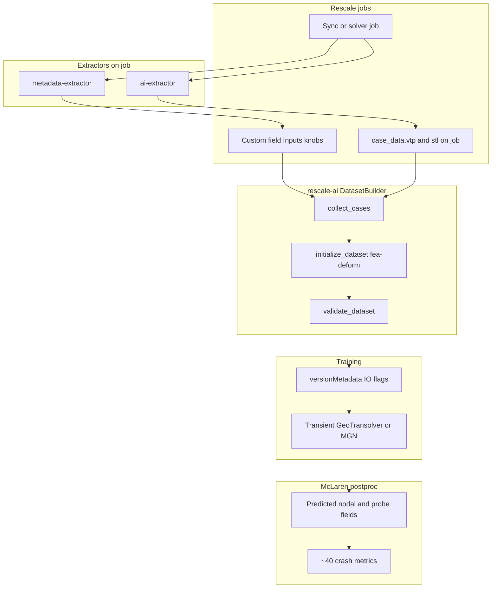

# McLaren LS-DYNA extraction + surrogate plan

## Goal

Build extractors so a Rescale AI Physics dataset can be created with:

```text
collect_cases → initialize_dataset(dataset_type="fea-deform") → validate_dataset
```

and end up **training-ready** such that **surrogate predictions alone** feed McLaren postproc for the **full ~40 crash evaluation metrics** (no LS-DYNA re-run, no “GT channels on the side”).

Hard requirements:

- **Global inputs** = all DOE knobs from the run-log XLSX (numeric custom fields → `case_data.yml` → `globalVariables` type `input`)
- **Nodal / probe outputs on `case_data.vtp`** = everything postproc needs: mesh `displacement_t*`, probe `acceleration_t*`, rib deforc kinematics, and **load-cell `force_t*` / `moment_t*`** on instrumented nodes
- After training, postproc derives HIC, A3ms, VC, resultants, peaks — the scorecard — **only from predicted VTP fields**

Starter corpus: **23 Comfort sync jobs**. Expansion: full run log (~50 = Comfort + Clubsport).

**Status 2026-08-07:** extractor path proven on Utilities (`hQdwMb`, AI `0.1.12` / Meta `0.2.14`). Meta **`0.2.16`** available for re-smoke (`custom_field` / parent-only + DOE scale). Work **paused** on batch-extracting the 23 pending design-space / more-sims call with James Imrie — see `HANDOFF.md`.


**Not a Neon port** for physics, but **same rescale-ai on-disk contract** as Neon (`case_data.vtp` + `case_data.stl`, `fea-deform`).

## End-to-end flow



## rescale-ai compatibility (hard requirements)

Platform contracts live in rescale-ai (`DatasetBuilder`, `validate_dataset.py`, neon tutorial handoff). Extractors **must** produce artifacts that satisfy this path:

### Required on-job files for `collect_cases`

| File | Role |
|---|---|
| **`case_data.vtp`** | Primary mesh + all nodal point arrays (fea-deform) |
| **`case_data.stl`** | Required by `validate_dataset` for fea-deform |
| Optional: `rescale-ai.vtp` | Alias/copy (OpenRadioss AI extractor already writes both) |
| Optional: rich `rescale-ai.vtu` / sidecars | Extra offline richness — **not** what platform validate requires |

```python
builder.collect_cases(
    name="mclaren-p35-es2-pole",
    jobs=jobs,  # starter 23 or expanded list
    file_patterns=["case_data.vtp", "case_data.stl"],
)
builder.initialize_dataset(
    name="mclaren-p35-es2-pole",
    dataset_type="fea-deform",  # hyphen, not fea_deform
    surface_file_name="case_data.vtp",
)
builder.validate_dataset("mclaren-p35-es2-pole")
```

### How knobs become global inputs

1. **metadata-extractor** registers **numeric** DOE fields as Rescale **custom fields** (section Inputs)
2. `collect_cases` reads custom fields → writes **`case_data.yml`**
3. `initialize_dataset` promotes YAML scalars → `versionMetadata.yaml` → `variables.globalVariables` with **`type: input`**

**Critical:** non-numeric catalog strings (`"E41"`, `"Base Condition"`, `"1.2mm"`) often warn / are weak as globals. Emit **parsed numeric / binary fields** as the custom fields used for training (see knob table). Keep human-readable catalog strings as additional text fields for UI if desired, but training globals must be numbers.

Excluded from data columns automatically: `job_id`, `run_id`, `case_dir`, etc.

### How nodal fields become expected outputs

1. AI extractor writes **point data arrays** on `case_data.vtp`
2. `initialize_dataset` registers every VTP point array under `nodeVariables` with default **`type: output`**
3. Transient / GeoTransolver trains on enabled time-series node outputs matching `*_t{number}` (e.g. `displacement_t0`, `displacement_t0.005`)

**Flag as node outputs (on VTP) — all required for full ~40:**

| Array | Why |
|---|---|
| `displacement_t{time}` | Mesh kinematics; fea-deform / Transient baseline (**required**) |
| `acceleration_t{time}` | Probe injury kinematics (head/T1/T12/pelvis); prefer GT nodout, not only d²u/dt² |
| `force_t{time}` / `moment_t{time}` (or named `fx_t*`… / `mx_t*`…) | Load-cell channels on instrumented probe nodes — **required** for neck/pubic/shoulder/backplate/T12 metrics |
| `velocity_t{time}` | Optional / useful for VC-related paths |
| `stress_vm_t{time}`, `effective_plastic_strain_t{time}` | Structural outputs (not a substitute for load-cell forces) |

**Flip after initialize (node input, not output):**

| Array | Why |
|---|---|
| `thickness` | Geometry/material gauge — Transient expects this as **node input** (Neon pattern) |

Bookkeeping arrays (`NODE_ID`, `PART_ID`, `IS_PROBE`, …) may need to be disabled as train targets in the UI / model config (keep on disk for postproc).

### `validate_dataset` checklist (must pass)

- `cases/caseN_<jobId>/` naming
- Each case has `case_data.vtp`, `case_data.stl`, `case_data.yml`, plus initialize-written `case_meta.yml`, `case_report.yml`
- VTP readable with **≥1 point array**
- Top-level `datasetMetadata.yaml` with `dataSetType: fea-deform`
- Version metadata has `globalVariables` + `nodeVariables`

Validate does **not** yet enforce `displacement_t*` naming — we still must emit that pattern for Transient training to work.

### Smoke test todo

After extractors run on a few jobs: execute collect → initialize → validate in rescale-ai; confirm globals list matches knob schema; confirm node outputs list includes all `*_t*` fields; set `thickness` → input; disable ID/mask arrays as outputs; then a tiny train smoke.

## Job corpus

### Starter set (23 sync / PSA jobs)

| Sync job | Synced from | Role |
|---|---|---|
| HFuKPb | HViTQc | Inboard seat foam CAE HP |
| ctowac | eiqgFc | E22 + airbag up 30mm |
| OQuKPb | giqgFc | E41 airbag up 30mm |
| Qhowac | XFOYWb | E22 + bracket cut |
| BFuKPb | QZYOQc | Bracket cut |
| MQuKPb | EfqgFc | Cavity 60gl + outer 1.1mm |
| zFuKPb | RHiTQc | Cavity 60gl + inner 1.3mm |
| xHdsac | mFfcFc | Cavity 60gl + inner 1.1mm |
| ifkFPb | AmPKQc | Outer 1.1mm |
| gfkFPb | NwPKQc | Inner 1.3mm |
| ixdsac | AmPKQc | Inner 1.1mm |
| UUjFPb | ymPKQc | Cavity 140gl |
| pHdsac | jwzzMb | Door brace P16 |
| afkFPb | eDEFQc | Rail foam |
| cxdsac | SaMTEc | Woodfibre trim |
| OUjFPb | jKVXEc | Cavity 60gl |
| YekFPb | emMTEc | E22 airbag |
| axdsac | sCuCTc | TTF 9ms |
| MUjFPb | hmESPc | Countermeasures plus |
| vVwVXb | vNXdac | Base ISF 207c |
| EbjaNb | NwPKQc | Outer 1.3mm *(backfill knobs)* |
| exteNb | eDoBSc | Base ISF 004 *(backfill)* |
| TAfpEc | eDoBSc | Base ISF 004 *(backfill)* |

### Expansion

Run log ~50 solver rows (Comfort + Clubsport). Same knobs; Clubsport adds Seat categorical. Extraction must not hard-code 23.

## DOE knobs → custom-field Inputs (for collect)

Emit these **numeric** Inputs on every job (metadata-extractor):

| Custom field name | Type | Encoding |
|---|---|---|
| `door_inner_mm` | number | 1.1 / 1.2 / 1.3 |
| `door_outer_mm` | number | 1.1 / 1.2 / … |
| `ttf_ms` | number | 9 / 12 |
| `airbag_E22` | number | 0/1 |
| `airbag_z_up_mm` | number | 0 or 30 |
| `bracket_cutt` | number | 0/1 |
| `trim_woodfibre` | number | 0/1 |
| `brace_P16` | number | 0/1 |
| `cavity_foam_gl` | number | 0 / 60 / 140 |
| `rail_foam` | number | 0/1 |
| `seat_inb_foam` | number | 0/1 |
| `seat_clubsport` | number | 0/1 when corpus expands |

Also emit raw catalog strings (Airbag, Door Inner, …) for humans/run-log parity — but **training globals = numeric table above**.

Do **not** use injury limits as model inputs.

**Airbag / bracket “up 30mm”:** often co-occur; prefer single `airbag_z_up_mm` unless proven independent.

## AI extractor — `case_data.vtp` contents

Mirror OpenRadioss AI extractor pattern: write **`case_data.vtp` + `case_data.stl`**, plus `rescale-ai.vtp` copy.

### Geometry

Keep vehicle + **ES-2re dummy** + barrier/contact partners; protect probe nodes through any decimation.

### Point arrays (nodal parameters → initialize as outputs)

Hard rule: **every signal McLaren postproc needs to compute the ~40 must exist as a predicted node/probe array**, not only as a CSV sidecar.

- `displacement_t{time}` on full surface mesh (**required**)
- `acceleration_t{time}` on injury probes (head/T1/T12/pelvis) from nodout (**required**)
- Rib deforc endpoint kinematics for defl/VC (**required**)
- Load-cell `force_t*` / `moment_t*` (or per-component names) on instrumented nodes for neck, pubic, shoulder, backplate, T12, abdomen, etc. (**required** — sourced from binout/PSA channels attached to fixed probe points)
- `velocity_t{time}`, `stress_vm_t{time}`, `effective_plastic_strain_t{time}` when available (structural; not force substitutes)
- `thickness` (later flagged **input**)
- `NODE_ID`, `PART_ID`, `IS_DUMMY`, `IS_PROBE` (postproc / masks; disable as train outputs)

### Overlays / sidecars (GT parity / QC only)

- `probe_map.json`, `contact_map.json`, `field_inventory.json`, `scorecard_field_map.json`
- `injury_channels/*.csv` — **parity check vs predicted scorecard only**; not a runtime substitute after deploy

Optional rich `rescale-ai.vtu` for offline — platform collect/validate remain VTP-first.

## Metadata extractor — findings + channels

- Injury peaks: HIC, A3ms, rib defl/VC, pubic, abdomen, …
- Load-cell / contact peaks and full channel CSVs (~45 families PSA uses)
- glstat globals for QC
- PSA fast path when `results.json` exists; else binout

These support evaluation / postproc; Transient training globals come from the **numeric knob Inputs**, not from findings.

## Getting the ~40 McLaren metrics from surrogate alone (hard requirement)

**No v1/v2 deferral.** After training, McLaren postproc must produce the full scorecard from **predicted VTP only**.

| Metric family | Train target on VTP | Postproc |
|---|---|---|
| Acc histories (head/T1/T12/pelvis) | Probe `acceleration_t*` (nodout GT) | Resultant, filter |
| HIC36, A3ms | Same predicted head / T12 acc | Standard HIC / A3ms formulas |
| Rib defl + VC | Probe/deforc kinematics | CFC + VC |
| Neck / pubic / shoulder / backplate / T12 F&M | Probe `force_t*` / `moment_t*` (binout load-cell GT) | Resultants, peaks, injury indices |
| Structural crush / QC | `displacement_t*` (+ stress/EPS if present) | Mesh metrics as needed |

**Train recipe:** `fea-deform` + Transient/GeoTransolver (or MGN) with **all** scorecard `*_t*` node outputs enabled (+ numeric globals). CSVs remain GT-only for parity.

**Platform risk (must clear before full train):** if Transient today only exports displacement, extend export / multi-target train so predicted force/acc arrays are written back to VTP. Extraction still puts all GT fields on VTP regardless.

## Split of responsibilities

| Component | Must produce |
|---|---|
| **metadata-extractor** | Numeric knob custom fields; injury/channel findings + CSVs; `ls_dyna` or utils+artifacts match |
| **ai-extractor** | `case_data.vtp` + `case_data.stl` (+ `rescale-ai.vtp`); mesh disp + **all scorecard probe arrays** (acc, force, moment, rib kin); probes protected |
| **rescale-ai** | collect → initialize(`fea-deform`) → validate; IO flag polish; train |

## Implementation targets

- AI stub → real path: [`automation-ai-extractor/.../ls_dyna`](file:///Users/anicolas/Documents/rescale-projects/automation-ai-extractor/src/core/solvers/ls_dyna/__init__.py) following OpenRadioss `case_data.*` write pattern + lasso d3plot ideas from [`rescale-ai/.../extractors/lsdyna`](file:///Users/anicolas/Documents/rescale-projects/rescale-ai/rescale_ai/agents/dataset/extractors/lsdyna/SUMMARY.md)
- Metadata expand: [`automation-metadata-extractor/.../lsdyna`](file:///Users/anicolas/Documents/rescale-projects/automation-metadata-extractor/src/core/solvers/lsdyna/__init__.py)
- Compatibility refs: neon handoff [`july-2026-neon-crash-tutorial-metadata.md`](file:///Users/anicolas/Documents/rescale-projects/rescale-ai/.cursor/handoffs/july-2026-neon-crash-tutorial-metadata.md), `validate_dataset.py`, `DatasetBuilder`

## Validation order

1. HFuKPb extract: files present (`case_data.vtp/stl`), knobs numeric on job, probes vs PSA CSV
2. rescale-ai smoke: collect 3–5 jobs → initialize fea-deform → validate
3. Confirm `versionMetadata` globals + node outputs; flip thickness; disable ID arrays
4. Backfill incomplete jobs; batch starter 23; optional train smoke
5. Expand corpus from spreadsheet when jobs available

## Explicit non-goals

- Relying on `rescale-ai.vtu` alone for platform validate
- Using string catalog fields as sole training globals
- Claiming mesh stress alone recovers load-cell forces (forces must be explicit probe targets)
- Shipping a displacement-only surrogate and calling the ~40 “done”
- Rebuilding PSA HTML/PPT inside extractors
- Using injury CSV sidecars as the production scorecard path after deploy
