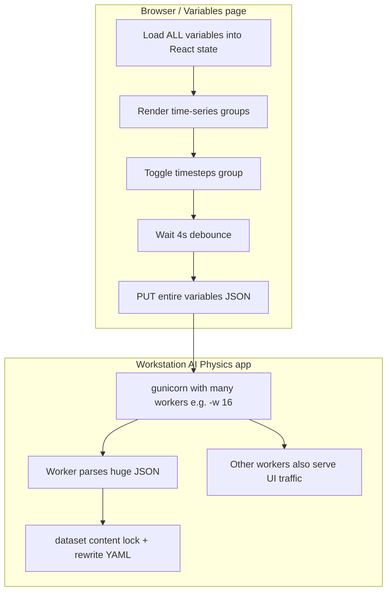

# Bug-fix plan — Variables UI OOMs workstation on large fea-deform datasets

**Status:** DONE — merged to `main` via [#1186](https://github.com/rescale/rescale-ai/pull/1186) (`1ef12cbc5`, 2026-08-14). See [`handoff-2026-08-variables-ui-oom-fix.md`](./handoff-2026-08-variables-ui-oom-fix.md).  
**Shipped:** sparse `PATCH /variables`, compact grouped `GET /variables`, `GET /variables/summary`, lazy cached case previews, DQ null-safety, Codex follow-ups for preprocessing/refinement expand.  
**Severity:** P0 for McLaren-scale `fea-deform` (crashed Training Workstations)  
**Repro (historical):** Open AI Physics → dataset → **Variables** → toggle one time-series **global** group → workstation memory collapses → SSH/UI die. **Train was never the trigger.**  
**Dataset shape that triggered it:** `mclaren-p35-side-pole-19` ≈ **1,640 global** entries (`39` probe bases × `41` timesteps + `timesteps_*` junk) + **hundreds** of node `*_t*` fields.

Related: [`geotransolver-global-ts-implementation-plan.md`](./geotransolver-global-ts-implementation-plan.md) (separate feature work).

---

## 1. Layman explanation — what you thought vs what happened

### What you reasonably expected
Flipping **off** the `timesteps` group is like unchecking one box in a settings form:

> “Don’t use these 41 junk time-index channels when training.”

That should update a **small settings file** (`versionMetadata.yaml`) and stop.

### What “after debounce PUTs the entire variables blob back (complete replacement)” means

Plain English:

1. **Debounce** = the UI waits ~**4 seconds** after your last click so it doesn’t spam the server on every flick of the switch.
2. Then it does **not** send “please set `timesteps_t0.000` … `timesteps_t0.080` to enabled=false.”
3. Instead it sends a **PUT** request whose body is **the full Variables document** — every global and every node variable, with your one group already flipped in that copy.
4. **Complete replacement** = the server throws away the old variables section and **writes the whole new list** back to YAML. Same end state as a tiny patch, but the **message is huge**.

Analogy:

| Approach | Like… |
|----------|--------|
| What you’d want (patch) | “On page 47 of the phone book, change Alice’s number.” |
| What the app does today | “Here is a **new photocopy of the entire phone book** with Alice’s number fixed — replace the old book with this.” |

For a normal dataset (dozens of variables), the photocopy is fine.  
For McLaren, the “phone book” is **~1,600+ globals** expanded as `name_t0.000`, `name_t0.002`, … — so every toggle ships / re-parses a **fat JSON**, and the Variables page itself has to **hold and render** that list.

### Why a “tiny toggle” can still kill the box

The YAML on disk is only ~**200 KB**. The crash is not “writing 200 KB needs 60 GB.”

It’s the **path around** that write:



On a workstation we observed:

- App runs **`gunicorn -w 16`** (16 Python server processes).
- Idle, those workers already use **multiple GB**.
- Opening Variables + saving coincides with **available RAM collapsing** (e.g. ~54 GB free → ~0.6 GB) and load spiking — classic **memory thrash**, then SSH banner timeouts.

So: **bug = Variables UX/API does not scale to fea-deform time-series cardinality**, not “toggling a boolean allocates 60 GB of physics data.”

---

## 2. Suspected root causes (ordered)

| # | Hypothesis | Why it fits | How to prove |
|---|------------|-------------|--------------|
| **H1** | **Cardinality explosion** — platform expands each TS base into one variable **per timestep** (`probe_fx_t0.000` …), so globals ≈ `G_bases × T` (~40×41). UI + API treat each as a first-class row. | Matches McLaren; small datasets fine | Count vars; compare RSS opening Variables on tiny vs McLaren set |
| **H2** | **Complete-replacement PUT** — every edit uploads/parses full list; debounce doesn’t reduce payload size. | Code: `useDatasetVariables` → `PUT` full body; route says “complete replacement” | Capture request body size; profile `update_dataset_version_variables` |
| **H3** | **Multi-worker amplification** — `-w 16` means many processes; concurrent GETs/PUTs/refetches while UI is open multiply peak RSS. | Observed 16 gunicorn workers; one worker already ~1 GB under UI load | `ps` RSS sum before/after opening Variables; try `-w 2` temporarily |
| **H4** | **Frontend cost** — React Query + tables holding ~2k variable objects; re-renders on optimistic updates. | More likely browser hang than host OOM, but adds pressure / retries | Chrome task manager vs `free -h` on host |
| **H5** | **Hidden extra work on Variables navigation** (less likely for toggle alone) — other APIs loading cases/meshes. | Would explain GB-scale jumps if true | Trace network tab + server logs for non-`/variables` calls |
| **H6** | **Lock + YAML dump under contention** — `dataset_content_lock` + `yaml.safe_dump` of full metadata while others read. | Can stall, usually not 60 GB alone | Timing around lock; dump size |

**Working theory for the write-up:** **H1 + H2 + H3**. The toggle is the user-visible trigger; the defect is **per-timestep variable materialization × full-document save × many workers**.

---

## 3. Goals / non-goals

**Goals**

- Toggling a TS group on McLaren-scale data must be **safe on ≤64 GB** workstations (ideally ≤32 GB).
- Prefer **patch** semantics for enable/type changes.
- Keep UX: one switch per **base name** (not 41 switches).

**Non-goals (this bugfix)**

- GeoTransolver global-output training feature (separate plan).
- Changing physics / probe schema itself (39 channels × 41 frames can stay; storage representation can change).

---

## 4. Fix directions (recommend layered)

### 4a. Quick mitigations (ops / McLaren now)

1. **Do not use Variables UI** for bulk edits on this dataset; patch YAML via script/SSH (already verified good state).
2. Document: Variables page is unsafe for `fea-deform` with large `T` until fixed.
3. Optional WS experiment: lower gunicorn workers (if configurable) and re-test — confirms H3.

### 4b. API: patch instead of full replace (high value, medium effort)

Add something like:

`PATCH /api/datasets/{id}/versions/{n}/variables`

Body example:

```json
{
  "updates": [
    { "scope": "global", "name": "timesteps_t0.000", "enabled": false },
    { "scope": "global", "name": "timesteps_t0.002", "enabled": false }
  ]
}
```

Or better, **group patch**:

```json
{
  "globalTimeSeriesGroups": [
    { "baseName": "timesteps", "enabled": false }
  ]
}
```

Server applies in place, rewrites YAML once, returns **only changed rows** or a short ack (not necessarily the full list).

Wire `updateVariablesBatch` to this PATCH.

### 4c. Data model: store TS as groups, expand lazily (high value, larger effort)

Today (conceptual):

```text
head_acceleration_x_t0.000, head_acceleration_x_t0.002, …  (×41)
```

Target:

```yaml
timeSeriesGlobalOutputs:
  - baseName: head_acceleration_x
    enabled: true
    type: output
    timesteps: [0.0, 0.002, ...]   # or shared timeline
```

UI lists **~40 rows**, not **~1600**. Training code can still expand to `outvar_ts [T,G]` when building Hydra/datapipe.

This is the durable fix for fea-deform.

### 4d. Frontend: don’t hold the full flat list in hot state

- Fetch **summaries** (base names + enabled + counts) for Variables page.
- Fetch flat names only when needed (export / rare).
- Virtualize tables if flat list remains.
- Optimistic update only the group row; don’t clone multi‑thousand-element arrays carelessly.

### 4e. Server process model

- Cap default workers on Training Workstations (e.g. relate to cores/RAM, not blind `-w 16`).
- Ensure Variables endpoints don’t pull case meshes into worker memory (audit `get_dataset_and_version` path).

### 4f. Guardrails

- Soft warn in UI when `len(globalVariables) > N` (e.g. 500): “Large time-series variable list; prefer group editor / may be slow.”
- Hard fail or chunked write if payload > X MB.
- Integration test: synthetic dataset with `G=50, T=40` flat vars → toggle group must stay under memory budget in CI (or at least under a RSS delta threshold in a soak test on a WS image).

---

## 5. Investigation plan (before / while coding)

1. **Repro on disposable WS** with metrics:
   - `free -h` + `ps` RSS for gunicorn **before** opening Variables  
   - Open Variables only → sample  
   - Toggle one group → sample every 1s for 30s  
   - Browser Network: size of GET/PUT `/variables`
2. **Confirm** PUT body ≈ full document size; time in `yaml.safe_load` / `safe_dump` / Pydantic validate.
3. **A/B**: same dataset with workers=2 vs 16.
4. **A/B**: dataset with only 5 bases × 41 vs full 40 × 41.
5. File internal ticket with repro + mem graphs; link this plan.

---

## 6. Implementation sequence (when approved)

| Step | Work | Outcome |
|------|------|---------|
| 0 | Ticket + repro metrics | Shared evidence |
| 1 | PATCH group/enable API + unit tests | Toggle without full body |
| 2 | Point Variables TS toggles at PATCH | McLaren safe path for enable/disable |
| 3 | Worker default / WS config sanity | Less amplification |
| 4 | (Follow-on) Grouped TS metadata schema + migrate expand-on-read | Structural fix |
| 5 | Soak test in CI or nightly WS | No regression |

---

## 7. Success criteria

- On 64 GB Kyanite, McLaren Variables: open + disable `timesteps` → **RAM available stays within ~few GB of baseline**, SSH stays up, no 503.
- Network: toggle request payload **≪** full variables document (orders of magnitude smaller).
- Existing small datasets unchanged in UX.
- No need to tell users “never open Variables” for normal-sized sets.

---

## 8. One-paragraph summary

You only unchecked a junk time-series group. That should flip flags in a settings YAML. Instead, the Variables UI loads **every timestep as its own variable** (~thousands of rows), waits 4 seconds, then **uploads a complete copy of that whole list** to a server running **many parallel workers**. On McLaren-scale `fea-deform`, that path is enough to **thrash workstation RAM** and look like an OOM crash — a real product bug. Fix with **patch/group APIs**, then longer-term **store time series as groups**, and stop running so many heavy workers by default on WS boxes.
